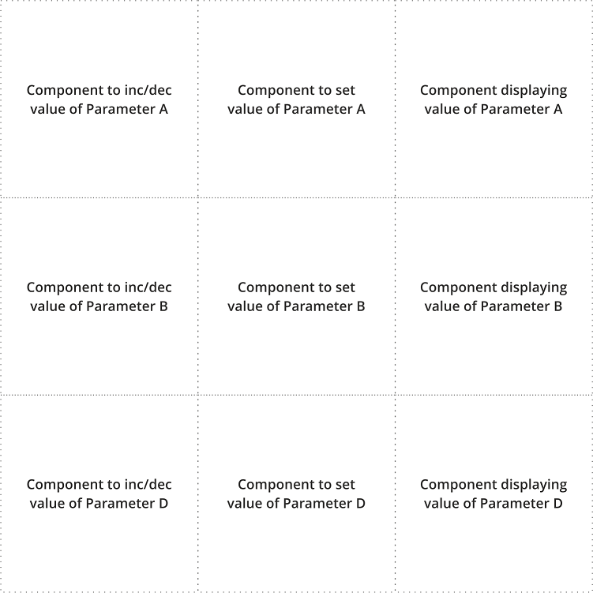
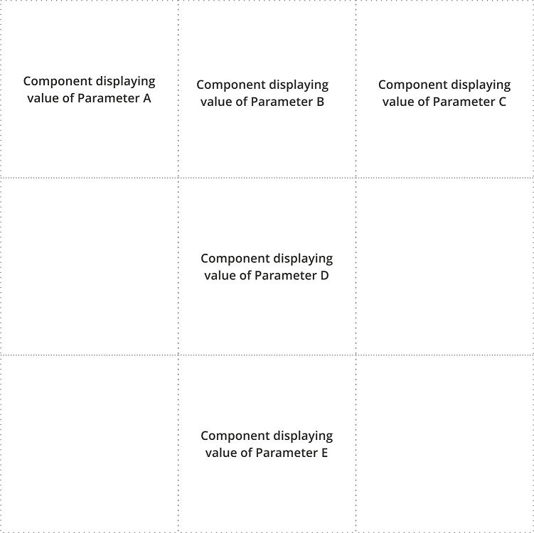
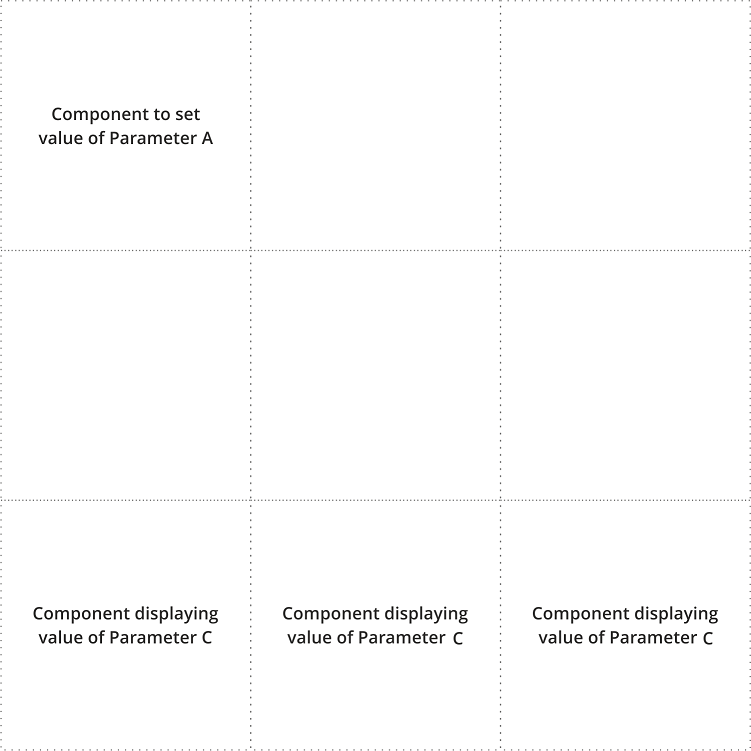

# Control panel

You are challenged to create a project that enables users to create their own control panels to set and display values
of some parameters. 

## Data specification

- There are 5 different parameters, simply called "Parameter A" ... "Parameter E".
- Each parameter is an integer number in a range <-100, 100> (*including -100 and 100*).
- There is only one set of these parameters stored in the backend's database (i.e. each control panel operates on the 
same 5 parameters).

## Front-end specification 

Front-end website will allow to add and remove control panels. 
Each control panel can have up to 9 instances of components (in a 3x3 grid, each cell can have one component) 
that allow the users to edit or display values of the parameters. 

### Components

Your user can choose between 3 components:

1) A component containing *plus* and *minus* buttons that, respectively, increase or decrease the value of 
the selected parameter by one.
2) A component containing an input that allows to set the value of the selected parameter.
3) A component displaying a current value of the selected parameter.  

For each component, the user should be able to select which of the 5 parameters the component is operating on.   

### Functionality

The details of the layout are left for you to design, but the front-end has to:

- Contain a list of all previously saved control panels. The list should allow to select a saved control
panel (after selection the panel is loaded) and to remove saved control panels.  
- Contain a grid 3x3 (9 cells). Each cell can have one component (user decides which component). Not every cell has to 
have a component assigned. The 3x3 grid with its components and selected parameters constitutes a control panel. 
- Contain a button to add current grid as a new control panel. For simplicity, there is no functionality to edit panels
and a name of the new panel is just a Linux timestamp (seconds elapsed since the Linux epoch, e.g. 1675096119)
at the time of creation.
- As mentioned, each component has to offer a possibility to select which parameter it operates on. 

### Other

- For components displaying values of the parameters, the values need to be loaded from the back-end after the page
reload and after changing them in the same panel (i.e. you don't need to care that the same parameter can be changed
from more than 2 panels at the same time).
- Accessing the root URL (e.g. http://localhost:8000) of the front-end should display empty grid.
- Accessing URL like e.g. http://localhost:8000/1675096119 should load control panel named *1675096119*.

## Back-end specification 

The back-end needs to provide REST endpoints to fulfill front-end functionalities. As described above, that includes:

- Get value of a parameter stored in the database.
- Set value of a parameter (including increasing / decreasing by one) and store it in the database.
- Get the list of saved control panels from the database.
- Add a new control panel configuration to the database.
- For given control panel name, get its configuration from the database.
- For given control panel name, remove existing (saved) control panel from the database.
- Possibly any other endpoint you may find necessary or useful. 

There is no user authentication, but endpoints should not accept invalid date (so validate the received data). 

## Technology 

In our team, we use Vite + Vue 3 for the front-end and Python for the back-end.

For front-end:
- You may use any front-end framework like React/Vue/Angular/Svelte or similar or even no framework at all.
- Please, however, use a package manager.
- Add *dev* command to your package manager config (like *package.json*) so that executing e.g. `npm run dev` serves your front-end.
- Assume the front-end runs on the newest Chrome browser. 

For back-end:
- Use Python with the Fast-API framework. 
- Provide *requirements.txt* file, so that running `pip install -r requirements.txt` will install libraries required 
by your project.
- For the database, you can use whatever method you find most suitable for this project (like SQLite or even file-based, no-sql databases).
- Your server will be started by running `uvicorn main:app --reload`, so create at least *main.py* file. 

For both:
- Serve back-end and front-end on *localhost*. Hardcode the back-end's port number (and host) in both back-end and front-end. 

## Examples of the control panels

To make the above description even more clear, here are a few examples of how control panels can be configured by 
your users:

An example of all cells populated with different components (not every parameter has to be used).

An example of a few cells populated only with components that display value of parameters. Notice, that some cells 
have no components assigned. 

An example of a few cells populated with different components. Notice, that the 3 bottom components display 
a value of the same Parameter C (so they will show the same value).

